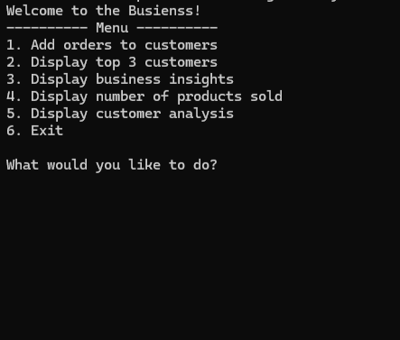

# Analyzing Customer Orders Using Python
## Course-End Project No.1

## Objectives
* Analyze customer orders using Python data structures to classify products
* Identify customer purchasing patterns
* Generate business insights

## User Interactive
### User can interact with terminal to view business insights. User can also add orders to set defined number of customers at random through the creation of mulitple classes and random module to create orders for each individual customer in the mock database.

